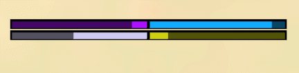
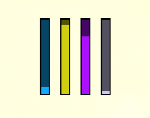
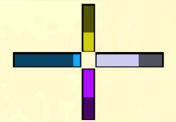

# progress2.inc

A SA:MP UI library for rendering progress bars used to visualise all manner of data from health to a countdown timer.

Library originally written by Flávio Toribio, Now maintained by Southclaws in version 2+ with new features.







## Installation

Simply install to your project:

```bash
sampctl package install Southclaws/progress2
```

Include in your code and begin using the library:

```pawn
#include <progress2>
```

## Usage

### Constants

* `MAX_PLAYER_BARS`:
  * Defaults to the textdraw limit divided by 3.
* `INVALID_PLAYER_BAR_VALUE`:
  * Invalid return value for interface functions.
* `INVALID_PLAYER_BAR_ID`:
  * Invalid bar ID value.
* `BAR_DIRECTION_RIGHT`:
  * Bar direction left-to-right
* `BAR_DIRECTION_LEFT`:
  * Bar direction right-to-left
* `BAR_DIRECTION_UP`:
  * Bar direction bottom to top
* `BAR_DIRECTION_DOWN`:
  * Bar direction top to bottom

### Functions

* `PlayerBar:CreatePlayerProgressBar(playerid, Float:x, Float:y, Float:width = 55.5, Float:height = 3.2, colour, Float:max = 100.0, direction = BAR_DIRECTION_RIGHT)`:
  * Creates a progress bar for a player.
* `DestroyPlayerProgressBar(playerid, PlayerBar:barid)`:
  * Destroys a player's progress bar.
* `ShowPlayerProgressBar(playerid, PlayerBar:barid)`:
  * Shows a player's progress bar to them.
* `HidePlayerProgressBar(playerid, PlayerBar:barid)`:
  * Hides a player's progress bar from them.
* `IsValidPlayerProgressBar(playerid, PlayerBar:barid)`:
  * Returns true if the input bar ID is valid and exists.
* `GetPlayerProgressBarPos(playerid, PlayerBar:barid, &Float:x, &Float:y)`:
  * Returns the on-screen position of the specified progress bar.
* `SetPlayerProgressBarPos(playerid, PlayerBar:barid, Float:x, Float:y)`:
  * Updates the position for a progress bar and re-renders it.
* `Float:GetPlayerProgressBarWidth(playerid, PlayerBar:barid)`:
  * Returns the width of a progress bar.
* `SetPlayerProgressBarWidth(playerid, PlayerBar:barid, Float:width)`:
  * Updates the width of a progress bar and re-renders it.
* `Float:GetPlayerProgressBarHeight(playerid, PlayerBar:barid)`:
  * Returns the height of a progress bar.
* `SetPlayerProgressBarHeight(playerid, PlayerBar:barid, Float:height)`:
  * Updates the height of a progress bar and re-renders it.
* `GetPlayerProgressBarColour(playerid, PlayerBar:barid)`:
  * Returns the colour of a progress bar.
* `SetPlayerProgressBarColour(playerid, PlayerBar:barid, colour)`:
  * Sets the colour of a progress bar.
* `Float:GetPlayerProgressBarMaxValue(playerid, PlayerBar:barid)`:
  * Returns the maximum value of a progress bar.
* `SetPlayerProgressBarMaxValue(playerid, PlayerBar:barid, Float:max)`:
  * Sets the maximum value that a progress bar represents.
* `Float:GetPlayerProgressBarValue(playerid, PlayerBar:barid)`:
  * Returns the value a progress bar represents.
* `SetPlayerProgressBarValue(playerid, PlayerBar:barid, Float:value)`:
  * Sets the value a progress bar represents.
* `GetPlayerProgressBarDirection(playerid, PlayerBar:barid)`:
  * Returns the direction of a progress bar.
* `SetPlayerProgressBarDirection(playerid, PlayerBar:barid, direction)`:
  * Updates the direction for a progress bar and re-renders it.

### Internal

* `_RenderBar(playerid, barid)`:
  * Renders a valid bar on-screen using it's current properties. Called on creation and whenever position, width or height are updated.

### Hooked

* `OnScriptInit`:
  * When y_iterate is used, initialises iterators.
* `OnPlayerDisconnect`:
  * To automatically destroy bars when a player disconnects.

## Testing

To test, simply run the package:

```bash
sampctl package run
```

And connect to `localhost:7777` to test.
